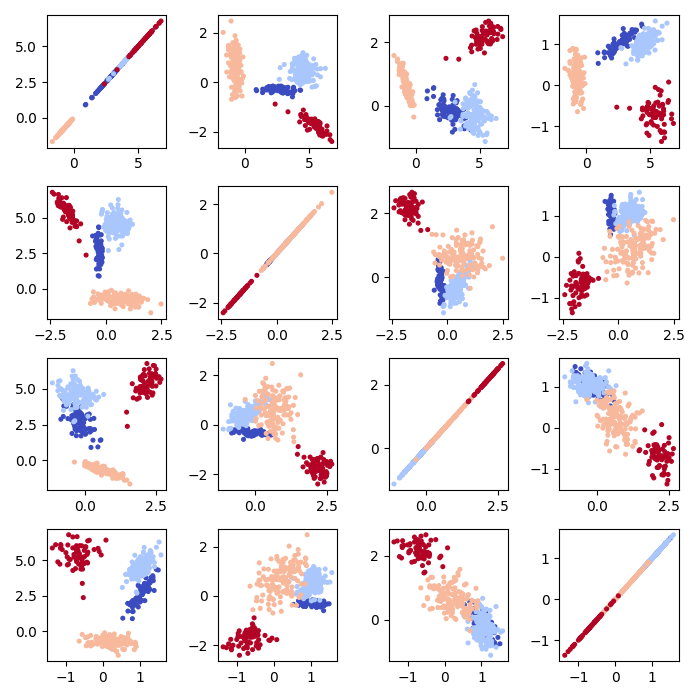
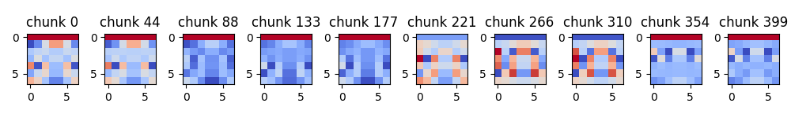

# Frequency Filtering Metadescriptor

**Abstract:**  Concept drift is among the primary challenges faced by the data stream processing methods. The drift detection strategies, designed to counteract the negative consequences of such changes, often rely on analyzing the problem metafeatures. This work presents the Frequency Filtering Metadescriptor – a tool for characterizing the data stream that searches for the informative frequency components visible in the sample’s feature vector. The frequencies are filtered according to their variance across all available data batches. The presented solution is capable of generating a metadescription of the data stream, separating chunks into groups describing specific concepts on its basis and visualizing the frequencies in the original spatial domain. The experimental analysis compared the proposed solution with state-of-the-art strategies in the post-hoc concept identification task. The research is followed by the identification of concepts in the real-world data streams. The generalization in the frequency domain adapted in the proposed solution allows capturing the complex feature dependencies as a reduced number of frequency components while maintaining the semantic meaning of data.

### Processing example:

```
stream = strlearn.streams.StreamGenerator(n_chunks=400, chunk_size=200, 
                                          n_features=15, n_informative=4, n_redundant=10, n_repeated=0,
                                          n_drifts=3, random_state=5678)

# Describe data
ffm = FFM(n=8)
des = ffm.describe(stream)

# Representation of size (n_chunks x n frequency components)
print(des.shape)

# Selected frequencies
print(ffm.arg_var)

# Cluster into concepts
clusters = ffm.cluster(c=4)
print(clusters)

# Visualize as images
vis = ffm.visualize()
print(vis.shape)
print(vis[0])

```

### Presentation
```
# Plot concept clusters
fig, ax = plt.subplots(4,4,figsize=(7,7))
for i in range(4):
    for j in range(4):
        ax[i,j].scatter(des[:,i], des[:,j], 
                        c=get_gt(400,3), cmap='coolwarm', 
                        s=7)
plt.tight_layout()
plt.savefig('clusters.png')
```


```
# Plot stream visualization
chunks = np.linspace(0,400-1,10).astype(int)
fig, ax = plt.subplots(1,10,figsize=(10,1.5))
for i in range(10):
    ax[i].imshow(vis[chunks[i]], cmap='coolwarm')
    ax[i].set_title('chunk %i' % chunks[i])
    
plt.tight_layout()
plt.savefig('visualization.png')

```


